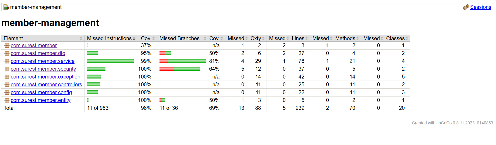
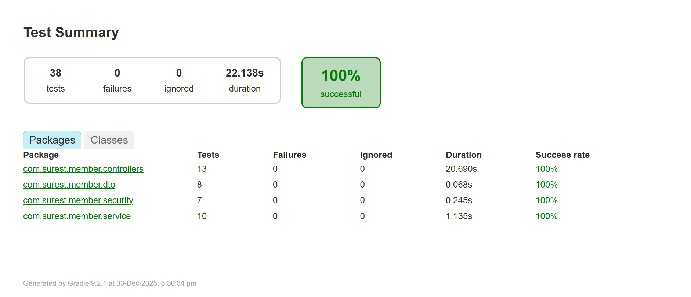
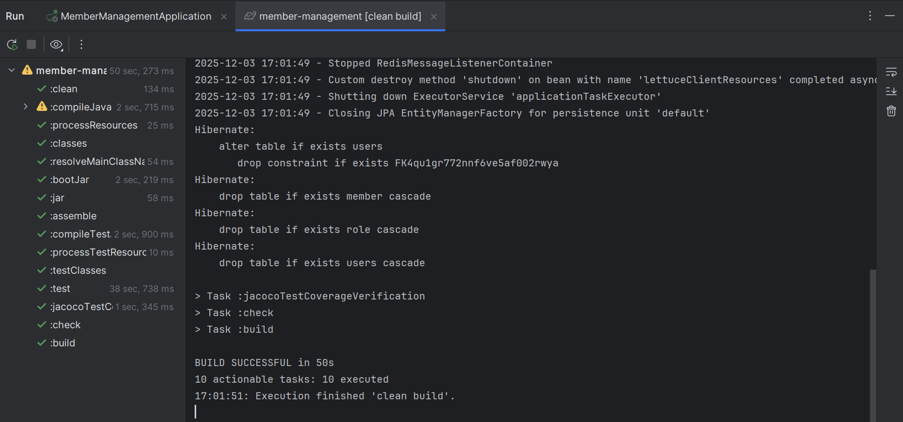
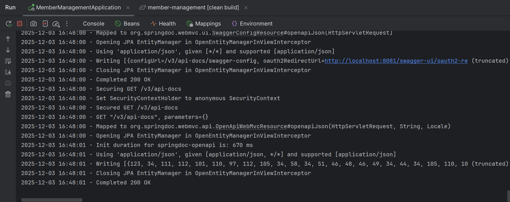

# Member Management System

This project is a **Member Management System** built with **Spring Boot**, **PostgreSQL**, and **Flyway** for database migrations. It supports member registration, login, role management, and JWT-based authentication.

---

## Table of Contents

- [Features](#features)
- [Tech Stack](#tech-stack)
- [Database Setup](#database-setup)
- [Testing](#testing)
- [Test Coverage](#test-coverage)
- [Project Structure](#project-structure)

---

## Features

- Register and manage members
- Role-based authentication (Admin/User)
- JWT authentication and authorization
- Database versioning using Flyway
- Redis caching
- API documentation with OpenAPI/Swagger

---

## Tech Stack

- **Backend:** Spring Boot 3.3.3, Java 17
- **Database:** PostgreSQL 16
- **Migrations:** Flyway 9.22.0
- **Caching:** Redis
- **Security:** Spring Security, JWT
- **Mapping:** MapStruct
- **Testing:** JUnit 5, Jacoco

---

### Test Coverage


### Unit Test


### Build Run


### Application Run


## Database Setup

1. Install PostgreSQL and create a database:

```sql
CREATE DATABASE "member-db";


